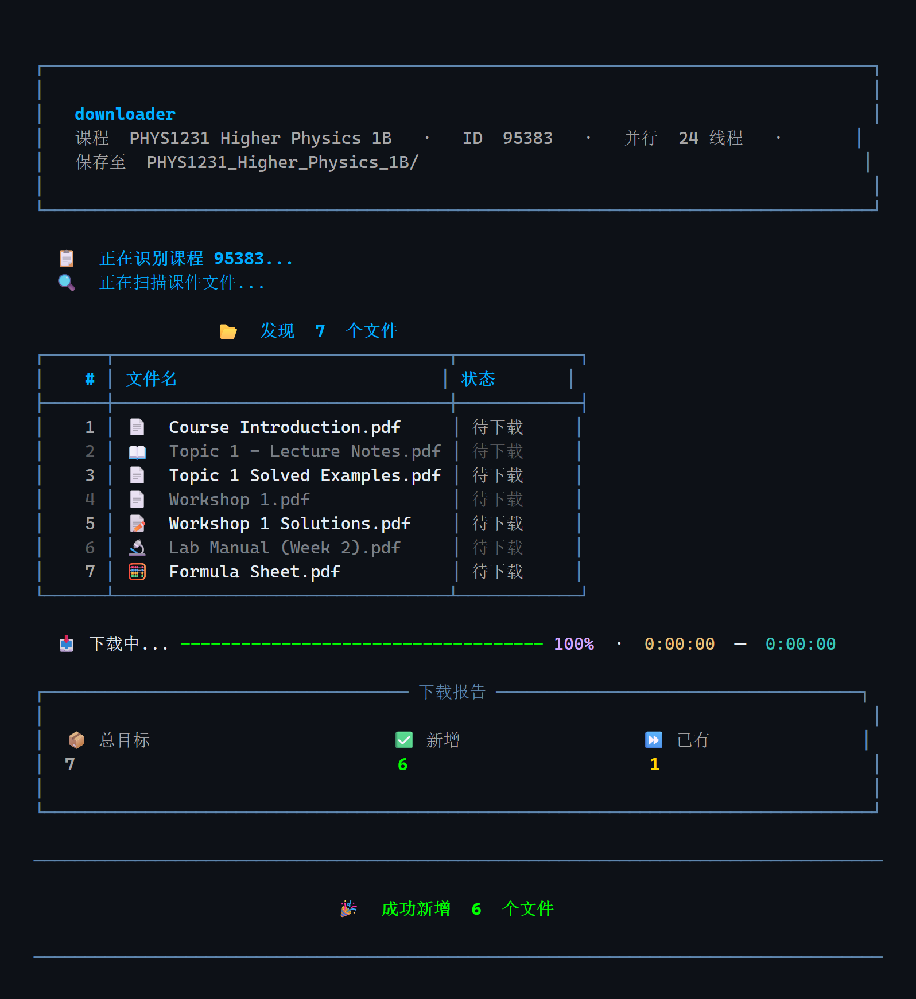
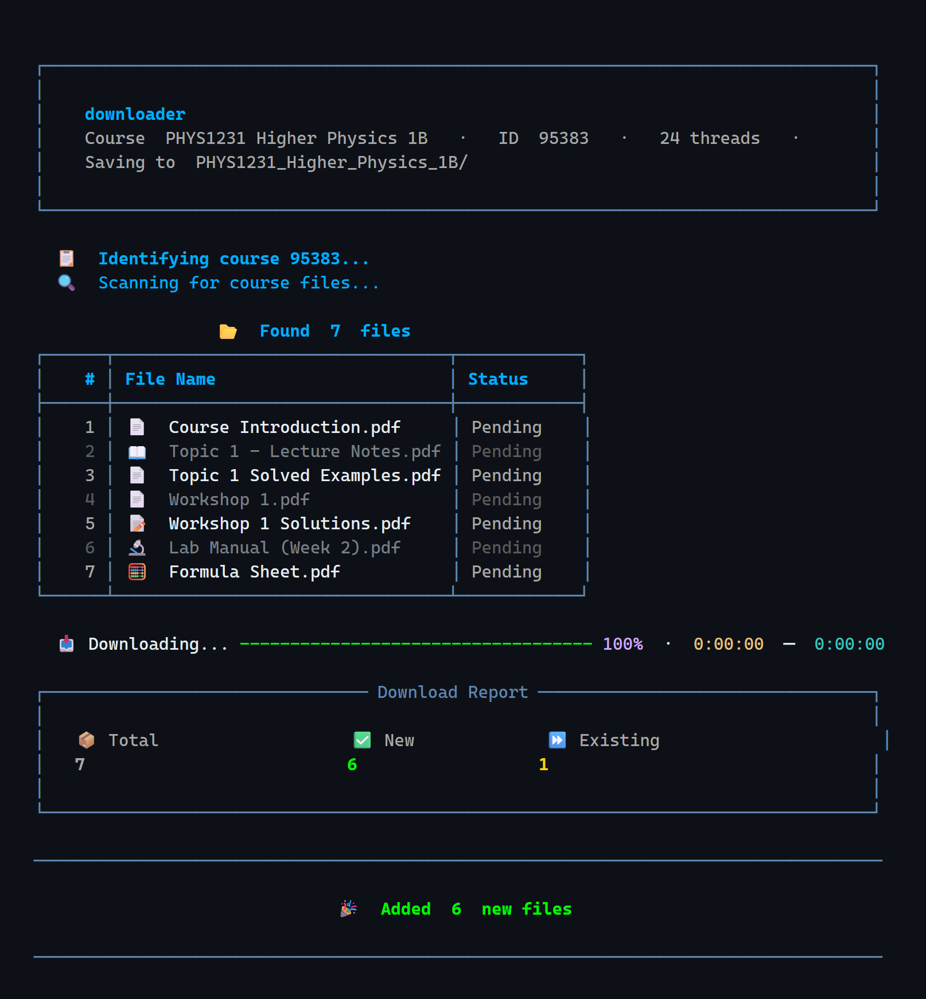

<div align="center">

# moodle-downloader

**一键同步 UNSW Moodle 课件到本地，然后让 AI 陪你复习。**
**Sync your UNSW Moodle course materials — then let AI revise them with you.**

[](https://www.python.org/)
[](LICENSE)
[](tests/)
[](#ai-revision)
[](https://github.com/KunyQi/moodle-downloader/releases)

[中文版](#中文版) · [English Version](#english-version)

</div>

<div align="center">

**下载器 + AI 复习助手**　·　Okta SSO 登录　·　24 线程并行　·　MCP · Obsidian · Jupyter　·　中 / EN

</div>

> [!IMPORTANT]
> **使用声明 / Disclaimer**
>
> 本工具仅供学生下载**自己已选课程**的课件用于**离线学习**。请遵守你所在院校的 IT 可接受使用政策（IT Acceptable Use Policy）。
>
> This tool is intended **only** for students downloading materials from courses they are **enrolled in**, for **offline study**. Always comply with your institution's IT Acceptable Use Policy.

---

## 中文版

### 简介

`moodle-downloader` 是一个面向 UNSW Moodle（`moodle.telt.unsw.edu.au`）的课程资料下载器。它通过真实浏览器完成 Okta SSO 登录，自动列出你已选的课程，深度扫描课程页面里的 PDF、PPT 等文件，然后并行下载到本地。重复运行时只会补齐新增文件——把它当成课件的"同步"工具即可。

**但下载只是开始。** v2.2.0 起，它内置一个 [MCP](https://modelcontextprotocol.io) 服务，把你的课件变成 **AI agent 能直接查询的知识库**——Claude Code、Claude Desktop 连上之后就能搜课件、看课程总览、排间隔重复复习计划，用你自己的讲义出题考你。还能一键导出 Obsidian 知识库和 Jupyter 复习笔记本。

👉 **[跳到「接入 AI Agent 复习」](#ai-revision)**

<p align="center">
  
</p>

### 工作原理

1. **登录一次** —— 弹出真实浏览器窗口完成 Okta 验证，登录状态本地保存复用
2. **选择课程** —— 自动列出你已选的全部课程，输入编号即可
3. **深度扫描** —— 遍历课程主页与子页面，挖出所有嵌套课件链接
4. **并行下载** —— 多线程同时下载，已有文件自动跳过，只补新增
5. **交给 AI** —— 索引课件，接上 agent，开始复习

### 亮点

- 🤖 **AI Agent 接入（MCP）** —— 内置 MCP 服务，Claude Code / Claude Desktop 等客户端直接连；5 个工具覆盖检索、总览与复习排期，手写 JSON-RPC，零额外依赖
- 🧠 **间隔重复复习计划** —— 按周次与材料类型排序，摊到 N 天，自动安排 d-1 / d-3 / d-7 回顾
- 📓 **Obsidian 知识库 + Jupyter 笔记本** —— 一条命令导出，笔记带 frontmatter、双链与「空白回忆」自测区
- **真实浏览器登录，支持 Okta SSO** —— 通过 Selenium 打开浏览器窗口完成登录，cookies 本地持久化并复用，通常只需登录一次
- **自动列出已选课程** —— 从 Moodle 首页读取你的课程列表，按编号选择，或直接输入课程 ID
- **深度扫描** —— 除课程主页外，还会钻入子页面，找到别的工具漏掉的嵌套 / 内嵌文件
- **并行下载** —— 默认 24 线程（可通过 `config.toml` 或 `--workers` 调整）
- **精致的终端界面** —— 带 ETA 的进度条、含文件类型图标的扫描结果表格、下载报告仪表盘和结果横幅（基于 Rich）
- **增量同步** —— 已存在于磁盘的文件自动跳过，随时重跑，只下新增
- **原子写入** —— 先写 `.part` 临时文件再重命名，绝不留下损坏的半成品
- **按关键词与扩展名过滤** —— 在 `config.toml` 中配置，只下你关心的文件
- **自动识别课程名** —— 文件保存到与课程同名的文件夹
- **中英双语界面**（v2.1.0 新增）—— `--lang en` 或配置文件一行切换
- **浏览器自动检测** —— Chrome → Edge → Firefox 依次尝试，也可用 `--browser` 强制指定
- **崩溃保护** —— 出错时控制台绝不闪退，错误信息完整可见
- **Windows 一键启动** —— 双击 `启动下载器.bat` 即可使用
- **隐私优先** —— 全程本地运行，不经手你的密码，不收集也不上传任何数据

### 安装

需要 **Python 3.11+**。

```bash
git clone https://github.com/KunyQi/moodle-downloader.git
cd moodle-downloader
pip install -r requirements.txt
```

依赖：`requests`、`beautifulsoup4`、`selenium`、`rich`。

另外需要至少一个浏览器驱动（与你的浏览器版本匹配）：

| 浏览器 | 驱动 |
| --- | --- |
| Chrome | [chromedriver](https://chromedriver.chromium.org/) |
| Edge | [msedgedriver](https://developer.microsoft.com/microsoft-edge/tools/webdriver/) |
| Firefox | [geckodriver](https://github.com/mozilla/geckodriver/releases) |

### 使用

```bash
python main.py                    # 自动登录 → 列出课程 → 选择下载
python main.py 98120              # 直接下载课程 98120
python main.py --browser chrome   # 指定浏览器 (chrome / edge / firefox)
python main.py --lang en          # 界面语言 (zh / en)
python main.py --workers 8        # 并行下载线程数
```

Windows 用户也可以直接双击 `启动下载器.bat`。

首次运行会打开浏览器窗口，在其中完成 Okta 登录即可；登录状态会保存在本地的 `moodle_cookies.json` 中，之后的运行通常无需再次登录。**该文件包含你的会话凭据，请勿提交到版本库或分享给他人。**

### 配置

编辑仓库根目录的 `config.toml`，重新运行即可生效：

```toml
[download]
max_workers = 24                          # 并行下载线程数

[filters]
file_keywords = ["lecture"]               # 文件名关键词（留空 = 全部接受）
file_extensions = [".pdf", ".ppt", ".pptx"]  # 扩展名白名单（留空 = 全部接受）

[ui]
language = "zh"                           # 界面语言: "zh" 或 "en"

[browser]
# type = "chrome"                         # 留空 = 自动检测 (chrome → edge → firefox)
```

<a id="ai-revision"></a>

### 🤖 接入 AI Agent 复习（v2.2.0 新增）

下载只是第一步。这些命令把硬盘上的课件变成**可检索的知识库**，让 Claude Code、Claude Desktop 等 AI agent 直接带你复习——全部操作本地文件，**无需登录**。

```bash
python main.py --index                      # 索引本地课件（默认当前目录）
python main.py --obsidian vault             # 导出 Obsidian 知识库
python main.py --obsidian vault --copy-files  # 同时把原文件复制进库
python main.py --notebook revision.ipynb --days 7   # 生成复习 notebook
```

**MCP 服务 —— agent 的接入点**

```bash
python -m moodle_scraper.mcp_server --root .
```

这是一个标准 [MCP](https://modelcontextprotocol.io) 服务（stdio / JSON-RPC，零额外依赖），任何 MCP 客户端都能接。在 Claude Code 里注册：

```bash
claude mcp add moodle -- python -m moodle_scraper.mcp_server --root /path/to/materials
```

暴露 5 个工具：

| 工具 | 作用 |
| --- | --- |
| `list_courses` | 列出本地已有的课程与材料统计 |
| `search_materials` | 按关键词全文检索课件 |
| `get_material_text` | 取出某份材料的正文 |
| `course_overview` | 按周次 / 类型总览一门课 |
| `revision_plan` | 把材料分配到 N 天的复习计划，含 d-1/d-3/d-7 间隔重复 |

接上之后，直接用大白话跟 agent 说：

```text
我 PHYS1231 下周考试，帮我排个 5 天复习计划
Week 3 讲了什么？用讲义里的内容出 5 道题考我
把所有提到「热力学第二定律」的材料找出来
```

agent 会调用上面的工具读你**本地真实的课件**来回答——不是凭空编的。

**Obsidian 知识库**：每门课一个 MOC 索引页，材料按周分目录，每篇笔记带 YAML frontmatter（课程 / 周次 / 类型 / 标签）、原文件嵌入、`## 复习要点` 空白区和正文摘要，互相 wikilink 连通。

**复习 Skill**：仓库内含 [`skills/moodle-revision/`](skills/moodle-revision/)，让支持 Skills 的 agent 学会一整套流程：选课 → 看总览 → 排间隔重复计划 → 用真实材料出题考你。

> 💡 **全文检索是可选增强**：PDF 正文提取需要 `pip install pypdf`（懒加载，不装也能跑，只是检索退化为按文件名匹配）。`.txt` / `.md` 无需任何额外依赖。

### 测试

```bash
python -m pytest tests/ -q
```

全部 280+ 项测试完全离线运行——通过一个假 HTTP 客户端注入预设响应，不会碰真实网络。

### 工程质量

- 全量类型标注：所有函数参数与返回值均有类型注解
- HTTP 访问隐藏在一个 `Protocol` 接缝之后：扫描器与下载器只依赖接口，不依赖 `requests`，因此可以完全离线测试
- 单个文件或页面失败不会中断整批下载，失败项会在最终报告中列出

### 贡献

欢迎提 Issue 和 PR。提交前请：

1. 运行 `python -m pytest tests/ -q` 确保测试通过
2. 保持全量类型标注，新增外部依赖时沿用 `HttpClient` Protocol 接缝模式
3. 测试通过假 HTTP 客户端进行，不要访问真实网络
4. 用户可见文案一律通过 `moodle_scraper/i18n.py` 的 `t()` 取词，中英目录须同步更新

### 常见问题

<details>
<summary><b>Cookie 过期了怎么办？</b></summary>

什么都不用做。工具每次启动都会先探测本地会话是否有效，失效时自动重新弹出浏览器让你登录一次，之后继续复用。
</details>

<details>
<summary><b>文件下载到哪里了？</b></summary>

仓库目录下、以课程名自动命名的文件夹，例如 `PHYS1231_Higher_Physics_1B/`。重复运行只补新增文件，不会重复下载。
</details>

<details>
<summary><b>为什么有些文件没被扫描到？</b></summary>

检查 `config.toml` 的 `[filters]`。默认只保留文件名含 `lecture` 或后缀为 `.pdf/.ppt/.pptx` 的文件——把两个列表都设为 `[]` 即可下载全部文件。
</details>

<details>
<summary><b>我的账号信息安全吗？</b></summary>

登录发生在你本机弹出的真实浏览器窗口里，工具不经手你的密码；它只把会话 cookie 保存在本地 `moodle_cookies.json`（已被 `.gitignore` 排除），不收集、不上传任何数据。代码全部开源，欢迎审计。
</details>

<details>
<summary><b>AI 功能会把我的课件传到云端吗？</b></summary>

工具本身不会。MCP 服务只在你本机运行，通过标准输入输出把数据交给你自己选择的 agent 客户端；索引、Obsidian 库、notebook 也都只写在本地磁盘。

需要留意的是：**当你让某个云端 AI（比如 Claude）读取这些内容时，被读到的那部分自然会发送给该服务商**——这取决于你用的是哪个 agent，与本工具无关。想完全离线，可以接本地模型。
</details>

<details>
<summary><b>没有 AI 也能用吗？</b></summary>

当然。下载、扫描、过滤这些核心功能完全独立，AI 层是可选的。就算只用 `--obsidian` 导出知识库自己看，也不需要任何 agent。
</details>

### 许可证

[MIT](LICENSE)

---

**⭐ 如果它帮你省下了在 Moodle 里逐页点击的时间，欢迎点个 Star——这也是让更多同学发现它的最好方式。**

---

## English Version

### About

`moodle-downloader` is a course-material downloader for UNSW Moodle (`moodle.telt.unsw.edu.au`). It signs you in through a real browser window (Okta SSO), lists the courses you are enrolled in, deep-scans course pages for PDFs, PPTs and other files, and downloads them in parallel. Re-running it only fetches what's new — think of it as "sync" for your lecture materials.

**But downloading is only the start.** Since v2.2.0 it ships an [MCP](https://modelcontextprotocol.io) server that turns your materials into **a knowledge base AI agents can query directly** — connect Claude Code or Claude Desktop and it can search your files, summarise a course, build a spaced-repetition plan, and quiz you from your own lecture notes. One command also exports an Obsidian vault and a Jupyter revision notebook.

👉 **[Jump to "AI agent revision"](#ai-revision-en)**

<p align="center">
  
</p>

### How it works

1. **Log in once** — a real browser window opens for Okta verification; your session is saved and reused
2. **Pick a course** — all your enrolled courses are listed automatically; just type a number
3. **Deep scan** — the course page and its sub-pages are crawled to surface every nested file link
4. **Parallel download** — multi-threaded downloads that skip anything already on disk
5. **Hand it to AI** — index the files, connect an agent, start revising

### Highlights

- 🤖 **AI agent access (MCP)** — a built-in MCP server any client can connect to (Claude Code, Claude Desktop); 5 tools covering search, overview and revision planning, hand-rolled JSON-RPC with zero extra dependencies
- 🧠 **Spaced-repetition planning** — materials ordered by week and kind, spread across N days, with automatic d-1 / d-3 / d-7 review slots
- 📓 **Obsidian vault + Jupyter notebook** — one command each; notes ship with frontmatter, wikilinks and blank-recall self-testing
- **Real-browser login with Okta SSO** — Selenium opens a browser window for you to sign in; cookies are persisted locally and reused, so login is usually one-time
- **Lists your enrolled courses** — read straight from the Moodle dashboard; pick by number or enter a course ID directly
- **Deep scan** — drills into course sub-pages to find nested / embedded files that other tools miss
- **Parallel downloads** — 24 threads by default (configurable via `config.toml` or `--workers`)
- **Polished terminal UI** — progress bars with ETA, scan-result tables with file-type icons, a download report dashboard and result banners (built on Rich)
- **Incremental sync** — files already on disk are skipped; re-run anytime to fetch only what's new
- **Atomic writes** — downloads go to a `.part` temp file, then rename; no corrupt half-downloads, ever
- **Keyword and extension filters** — configure in `config.toml` to download only what you care about
- **Auto-detects the course name** — files are saved into a matching folder
- **Fully bilingual interface** (new in v2.1.0) — switch between Chinese and English with `--lang en` or one line of config
- **Browser auto-detect** — tries Chrome → Edge → Firefox, or force one with `--browser`
- **Crash guard** — the console never closes silently on error; you always see what went wrong
- **Windows one-click launcher** — double-click `启动下载器.bat` and go
- **Privacy-first** — everything runs locally; the tool never handles your password, collects nothing and uploads nothing

### Install

Requires **Python 3.11+**.

```bash
git clone https://github.com/KunyQi/moodle-downloader.git
cd moodle-downloader
pip install -r requirements.txt
```

Dependencies: `requests`, `beautifulsoup4`, `selenium`, `rich`.

You also need at least one WebDriver matching your browser:

| Browser | Driver |
| --- | --- |
| Chrome | [chromedriver](https://chromedriver.chromium.org/) |
| Edge | [msedgedriver](https://developer.microsoft.com/microsoft-edge/tools/webdriver/) |
| Firefox | [geckodriver](https://github.com/mozilla/geckodriver/releases) |

### Usage

```bash
python main.py                    # login → list courses → pick & download
python main.py 98120              # download course 98120 directly
python main.py --browser chrome   # force a browser (chrome / edge / firefox)
python main.py --lang en          # UI language (zh / en)
python main.py --workers 8        # number of parallel download threads
```

On Windows you can also just double-click `启动下载器.bat`.

The first run opens a browser window — complete the Okta login there. Your session is saved locally to `moodle_cookies.json`, so subsequent runs usually skip the login entirely. **That file holds your session credentials — never commit it or share it.**

### Configuration

Edit `config.toml` in the repo root; changes take effect on the next run:

```toml
[download]
max_workers = 24                          # parallel download threads

[filters]
file_keywords = ["lecture"]               # filename keywords (empty = accept all)
file_extensions = [".pdf", ".ppt", ".pptx"]  # extension whitelist (empty = accept all)

[ui]
language = "en"                           # UI language: "zh" or "en"

[browser]
# type = "chrome"                         # empty = auto-detect (chrome → edge → firefox)
```

<a id="ai-revision-en"></a>

### 🤖 AI agent revision (new in v2.2.0)

Downloading is only step one. These commands turn the files on your disk into a **searchable knowledge base** that Claude Code, Claude Desktop and other AI agents can revise with you — all local, **no login required**.

```bash
python main.py --index                      # index local materials (defaults to cwd)
python main.py --obsidian vault             # export an Obsidian vault
python main.py --obsidian vault --copy-files  # also copy the source files in
python main.py --notebook revision.ipynb --days 7   # build a revision notebook
```

**MCP server — the agent entry point**

```bash
python -m moodle_scraper.mcp_server --root .
```

A standard [MCP](https://modelcontextprotocol.io) server (stdio / JSON-RPC, zero extra dependencies) that any MCP client can talk to. Register it with Claude Code:

```bash
claude mcp add moodle -- python -m moodle_scraper.mcp_server --root /path/to/materials
```

It exposes 5 tools:

| Tool | What it does |
| --- | --- |
| `list_courses` | List local courses with material counts |
| `search_materials` | Full-text search across your course files |
| `get_material_text` | Pull the text of one material |
| `course_overview` | Break a course down by week and type |
| `revision_plan` | Split the material across an N-day plan with d-1/d-3/d-7 review slots |

Once connected, just talk to your agent in plain language:

```text
I have a PHYS1231 exam next week — build me a 5-day revision plan
What was covered in week 3? Quiz me on it using the lecture notes
Find every material that mentions the second law of thermodynamics
```

The agent answers by calling those tools against **your real local files** — not from memory.

**Obsidian vault**: one MOC per course, materials bucketed by week, and every note carrying YAML frontmatter (course / week / kind / tags), an embed of the source file, a blank "key points" section and a text summary — all wikilinked together.

**Revision Skill**: the repo ships [`skills/moodle-revision/`](skills/moodle-revision/), which teaches a Skills-capable agent the whole loop: pick a course → review the overview → build a spaced-repetition plan → quiz you from the real material.

> 💡 **Full-text search is an optional upgrade**: extracting text from PDFs needs `pip install pypdf` (lazily imported — without it everything still runs, search just falls back to filename matching). `.txt` / `.md` need nothing extra.

### Tests

```bash
python -m pytest tests/ -q
```

All 280+ tests run fully offline — they inject pre-registered responses through a fake HTTP client and never touch the network.

### Engineering notes

- Fully type-annotated: every function parameter and return value carries a type hint
- HTTP access sits behind a `Protocol` seam: the scanner and downloader depend only on the interface, never on `requests`, which is what makes the test suite completely offline
- Per-item failure isolation: one bad page or file never aborts the batch; failures are listed in the final report

### Contributing

Issues and PRs are welcome. Before submitting:

1. Run `python -m pytest tests/ -q` and make sure everything passes
2. Keep full type annotations, and follow the `HttpClient` Protocol seam pattern when adding external dependencies
3. Write tests against the fake HTTP client — no real network access in tests
4. Route every user-visible string through `t()` in `moodle_scraper/i18n.py`, keeping the zh and en catalogs in sync

### FAQ

<details>
<summary><b>My cookies expired — what do I do?</b></summary>

Nothing. On every run the tool first probes whether your saved session is still valid; if it isn't, a browser window opens automatically for a one-time re-login, and the new session is reused afterwards.
</details>

<details>
<summary><b>Where do my files go?</b></summary>

Into a folder named after the course, right in the repo directory — e.g. `PHYS1231_Higher_Physics_1B/`. Re-running only fetches new files; nothing is downloaded twice.
</details>

<details>
<summary><b>Why are some files missing from the scan?</b></summary>

Check `[filters]` in `config.toml`. By default only filenames containing `lecture` or ending in `.pdf/.ppt/.pptx` are kept — set both lists to `[]` to download everything.
</details>

<details>
<summary><b>Is my account safe?</b></summary>

You log in inside a real browser window on your own machine — the tool never sees your password. It only stores the session cookie locally in `moodle_cookies.json` (already in `.gitignore`), collects nothing, and uploads nothing. The code is fully open source — audit away.
</details>

<details>
<summary><b>Do the AI features upload my materials to the cloud?</b></summary>

Not by this tool. The MCP server runs entirely on your machine and hands data to whichever agent client *you* choose over stdio; the index, the Obsidian vault and the notebook are all written to local disk only.

Worth being clear about: **when you ask a cloud AI (Claude, for instance) to read that content, the parts it reads do go to that provider** — that follows from the agent you picked, not from this tool. Point it at a local model if you want to stay fully offline.
</details>

<details>
<summary><b>Can I use it without any AI?</b></summary>

Absolutely. Downloading, scanning and filtering are completely independent — the AI layer is optional. Even `--obsidian` on its own is useful without ever connecting an agent.
</details>

### License

[MIT](LICENSE)

---

**⭐ If this tool saved you from clicking through Moodle page by page, consider leaving a star — it's the best way to help other students find it.**
